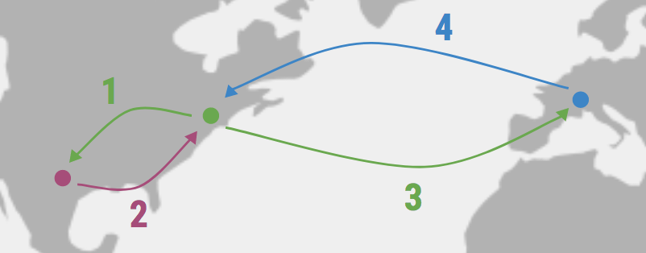

## Week 1 Introduction & Workspace Set-Up

### HOW DO PEOPLE ACCESS THE INTERNET?
* People access the internet through **web browsers**.
* A **web browsers** is a program running on your computer (or smart phone, or iPad or...) through which you access the World Wide Web. The browser’s job is to make it possible for you to visit pages on the web.

* **Web Servers** are computers that are always connected to the internet and optimized to send web page data out to the people who request them. 

### HOW DOES THE INTERNET WORK?
* If we enter a **URL**, or **Universal Resource Locator**, into a browser… 

* The URL gets **parsed** by the  browser. (**Parse** is just a fancy term for dividing something into pieces.)

#### URLs are formatted like this: 

* **Protocol** is the **“how”** – it tells your computer which conventions to use when talking to the computer serving the requested page.
 
* **Server** is the **“where”** – it tells your computer the name of the computer serving the requested page. 

* **Path** is the **“what”** – it indicates which page you’re interested in accessing on the requested website. 

#### Here is an example:

 
    
   * The desired **protocol** is **“http”**, which is a special set of rules for requesting and receiving web content. 
   * The **server** is **“www.github.com”**, which is the name for one or more computers operated by Github. 
   * The **path** is **“/compagnb“**, which is the name associated with a particular page among many available at the github website.

#### After we connect through an ISP...

     
    
   * First **Browser** connects to the **DNS server**.
    
   * The **DNS server** then tells the **browser** the location of the web server hosting the site.

   * The **IP Address** that the **DNS server** returns to your computer allows your browser to contact the **web server** that hosts the website you requested.
    
   * The **web server** then sends the page you requested back to your web browser.
    
* **ISP** is short for an **Internet Service Provider**, this is a company that provides access to the internet. (i.e. Verizon, optimum, aol)

* **DNS Server** is short for **Domain Name System**, this server translates domain names and hostnames into an IP address. This works like a big phone book! 
 
* **IP Address** is short for **Internet Protocol Address**, it is a unique string of numbers separated by periods that identify each computer connected using an **Internet Protocol** to communicate over a network. (i.e. 127.0.0.0)

* When the browser sends a message to the web server called an **HTTP Request**. It answers the browser with an **HTTP Respond**. 
    
  

* And when it can’t find what the browser requested...The **HTTP Response** is a 404 error. 

 

### WEB DEVELOPMENT IS ALL ABOUT COMMUNICATION.

 

* The **client**, which requests pages from the server, and displays them to the user. In most cases, the client is a web browser. The user uses the client in order to surf the web, fill in forms, watch videos online, etc.
* The **server**, which is responsible for serving pages.
* There are two different types of web programming:
   * **Client-Side programming**
      * make interactive web pages
      * make stuff happen dynamically on a web page 
      * interact with temporary storage, and local storage (cookies, localStorage) 
      * Languages used: HTML, CSS, JavaScript
   * **Server-Side Programming**
      * Process user input
      * Display pages
      * Structure web applications
      * Interact with permanent storage (database & files)
      * Languages used: JavaScript, Rails, Java, Python, SQL, PHP, etc.

#### Connecting to a website without a database would look like this:

 

   * Client asks server for page (“Do you have this page?”).
   * Server generates the page (create .html file)
   * Server sent the page to the client (“There is the page”).

#### Connecting to a website with a database would look like this:

 
   * Client asks server for page (“Do you have this page?”).
   * Server asks database for info to populate the page (“Found page, need information to load the page”).
   * Database sends information to server (“sends the information”).
   * Server uses information to generate the page (create .html file)
   * Server sent the page to the client (“There is the page”).

### In-class Exercises/Challenges: 
    * Create a program to calculate our weight on the moon (or any planet):
        

### VOCABULARY:
* web browser
* web server
* url
* parse
* protocol
* server
* client
* path
* Internet Service Provider (ISP)
* dns server
* ip address
* http request
* http response
* client side programming
* server side programming
* Camelcase

### KEYWORDS:
* var 
* http
* createServer
* function
* writeHead
* \n
* listen
* process.env.PORT
* process.env.IP
* console.log
